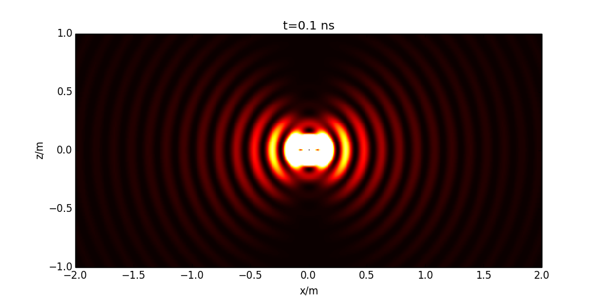

Dipole
======

`dipole.jl` is a set of functions that computes te electromagnetic radiation of an Hertz dipole (E and B fields).

The full fields are derived from the following formulas:

A time domain radiation of one dipole is rendered. An image sequence shows the total power radiated

##Requirements
* Julia 0.2 or +
* PyPlot
